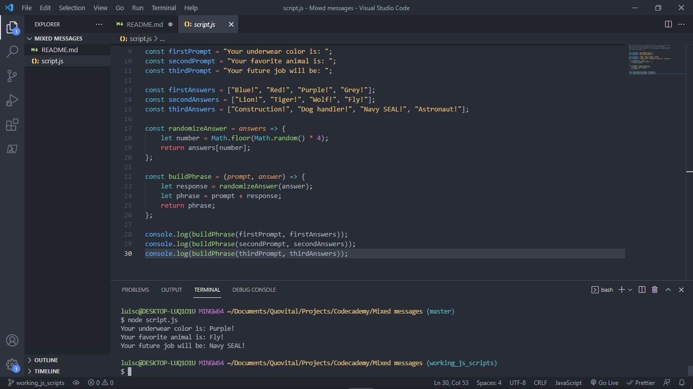

# Mixed Messages

> This is an app designed to randomize three different messages with answers that seem offbeat or funny.

## Table of Contents

- [Mixed Messages](#mixed-messages)
  - [Table of Contents](#table-of-contents)
  - [General Information](#general-information)
  - [Technologies Used](#technologies-used)
  - [Features](#features)
  - [Screenshots](#screenshots)
<!-- * [License](#license) -->

## General Information

- The app receives three predetermined prompts and then takes from a list of possible endings in order to provide answers.
- The three promts will represent the user's underwear color, favorite animal and future job.
- The list of possible answers will be picked by the developer.
- This is a project for the Full Stack Developer Carreer Path on Codecademy.
<!-- You don't have to answer all the questions - just the ones relevant to your project. -->

## Technologies Used

- Javascript 1.5.
- Markdown.

## Features

List the ready features here:

- Has a function designed to randomize output which takes two arguments: a prompt and an answer, both are arrays of possible strings.

## Screenshots

